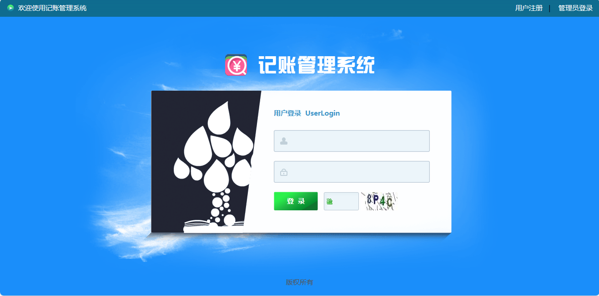

<h1 align="center">基于SSH的记账管理系统</h1>

 获取sql文件 QQ: 386869957 QQ群: 377586148 

 [个人站点: 从戎源码网](https://armycodes.com/)

## 简介

> 本代码来源于网络,仅供学习参考使用!
> 
> 提供1.远程部署/2.修改代码/3.设计文档指导/4.框架代码讲解等服务
>
> 用户登录地址：http://localhost:8080/login.jsp
>
> 用户名： user   密码： 123456
>
> 管理员登录地址：http://localhost:8080/adminlogin.jsp
>
> 用户名： admin   密码： 123456
>

## 项目介绍

基于SSH的记账管理系统：前端 Jsp、freemarker、Jquery，后端 Struts、Spring、Hibernate，系统角色分为：用户、管理员，用户登录后进行财务记账，支持搜索，月和年收支信息汇总；主要功能如下：

### 用户：

- 基本功能：登录、注册、退出
- 信息管理：个人信息修改，字段包括登录号、密码、姓名、性别、年龄、电话
- 财务管理：添加记账、查看详情、记账删除、根据类型种类和名称搜索，字段包括名称、类型、种类、时间、金额、用途
- 财务统计：月收支查询、按月选择查询结果展示、年收支查询、按年份选择查询结果展示

### 管理员：

- 管理员信息管理：管理员信息列表、添加管理员、管理员信息查看、管理员信息修改、管理员信息删除、搜索
- 用户信息管理：用户信息列表、用户信息删除、搜索

## 环境

- <b>IntelliJ IDEA 2009.3</b>

- <b>Mysql 5.7.26</b>

- <b>Tomcat 7.0.73</b>

- <b>JDK 1.8</b>

## 运行截图

