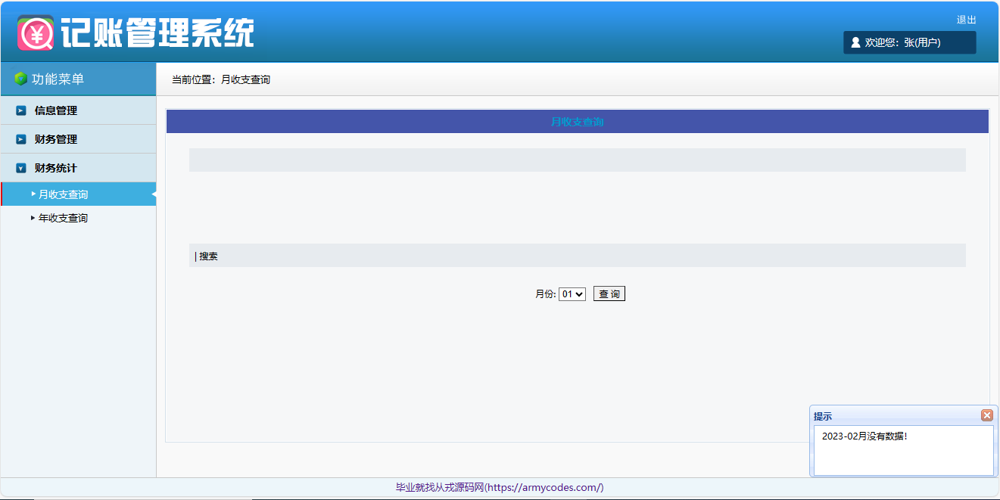

<h1 align="center">基于SSH的记账管理系统</h1>

- 完整代码获取地址：从戎源码网 ([https://armycodes.com/](https://armycodes.com/))
- 作者微信：19941326836  QQ：952045282 
- 承接计算机毕业设计、Java毕业设计、Python毕业设计、深度学习、机器学习
- 选题+开题报告+任务书+程序定制+安装调试+论文+答辩ppt 一条龙服务
- 所有选题地址（https://github.com/YuLin-Coder/AllProjectCatalog）

## 项目介绍

基于SSH的记账管理系统：前端 Jsp、freemarker、Jquery，后端 Struts、Spring、Hibernate，系统角色分为：用户、管理员，用户登录后进行财务记账，支持搜索，月和年收支信息汇总；主要功能如下：

### 用户：

- 基本功能：登录、注册、退出
- 信息管理：个人信息修改，字段包括登录号、密码、姓名、性别、年龄、电话
- 财务管理：添加记账、查看详情、记账删除、根据类型种类和名称搜索，字段包括名称、类型、种类、时间、金额、用途
- 财务统计：月收支查询、按月选择查询结果展示、年收支查询、按年份选择查询结果展示

### 管理员：

- 管理员信息管理：管理员信息列表、添加管理员、管理员信息查看、管理员信息修改、管理员信息删除、搜索
- 用户信息管理：用户信息列表、用户信息删除、搜索

## 环境

- <b>IntelliJ IDEA 2009.3</b>

- <b>Mysql 5.7.26</b>

- <b>Tomcat 7.0.73</b>

- <b>JDK 1.8</b>

## 运行截图

